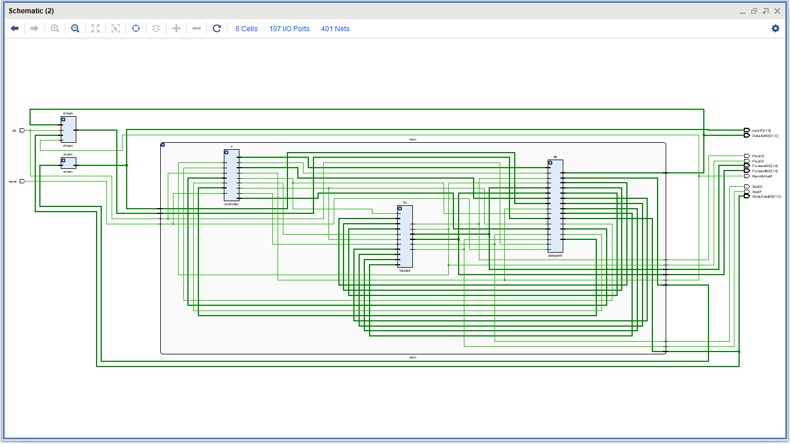
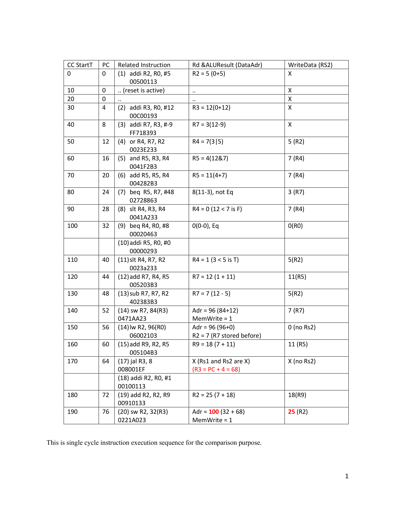
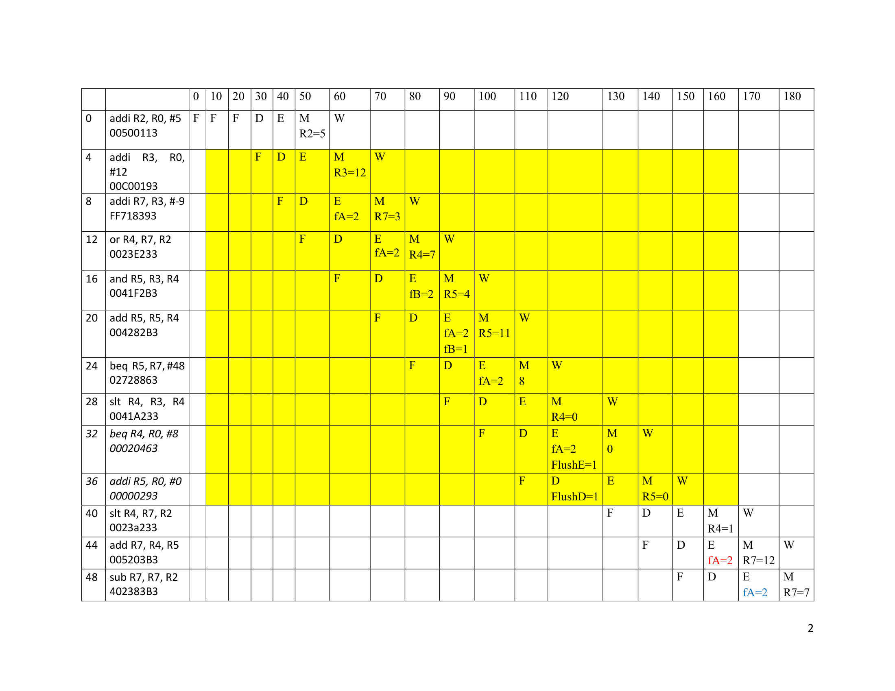
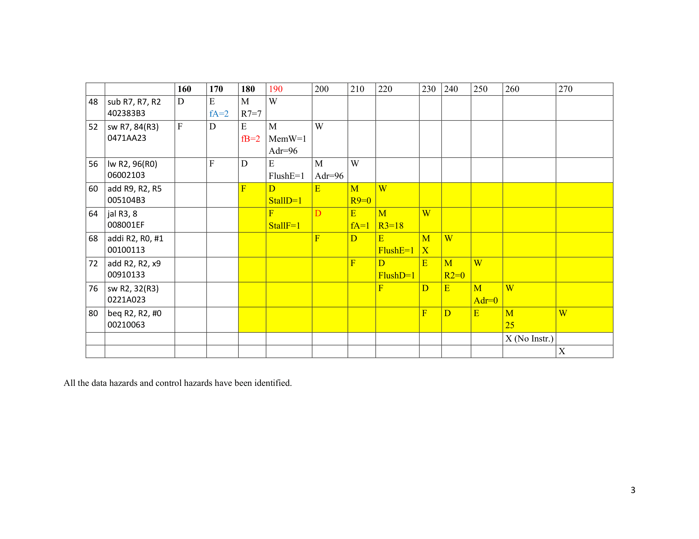
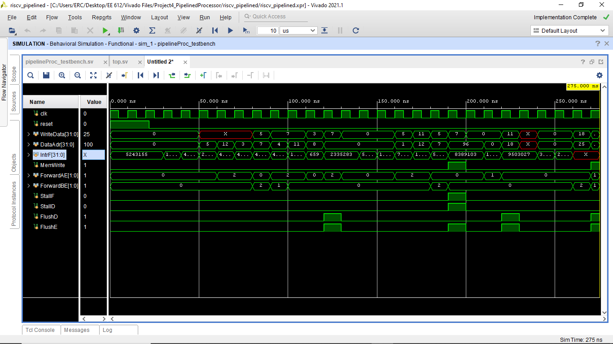
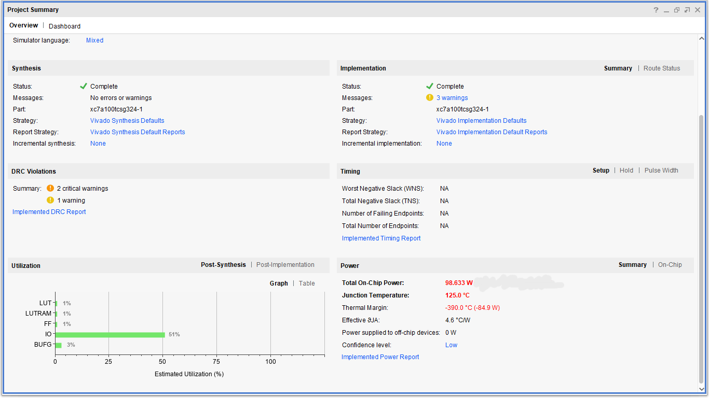
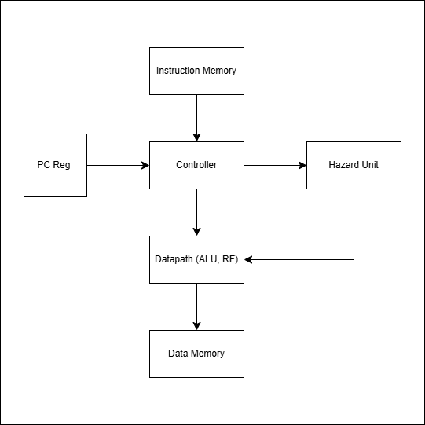

# Pipelined RISC-V Processor (SystemVerilog)

This project implements a five-stage pipelined RISC-V processor in SystemVerilog.
The design includes hazard detection, data forwarding, and pipeline control
mechanisms to support correct and efficient instruction execution.

The processor was verified through simulation and synthesized using Xilinx Vivado.

---

## Key Results

• Implemented a **5-stage pipelined RISC-V processor (RV32I subset)** in SystemVerilog  
• Designed **hazard detection and forwarding logic** to resolve RAW dependencies  
• Implemented **pipeline stall and flush control** for correct branch handling  
• Verified processor behavior using **SystemVerilog simulation testbench**  
• Successfully synthesized design using **Xilinx Vivado**

Key verification artifacts included:
- Instruction execution trace validation
- Pipeline hazard analysis
- Simulation waveform verification

---

## Processor Architecture

The processor consists of several major components:

- **Controller** – instruction decoding and generation of control signals  
- **Datapath** – ALU operations, register interactions, and data routing  
- **Hazard Unit** – detection and resolution of data and control hazards  
- **Instruction and Data Memory Interfaces**

---

## Pipeline Stages

The processor follows a standard five-stage pipeline:

1. **Instruction Fetch (IF)** – fetch instruction from instruction memory  
2. **Instruction Decode (ID)** – decode instruction and read register file  
3. **Execute (EX)** – perform ALU operations and branch evaluation  
4. **Memory Access (MEM)** – access data memory for load/store instructions  
5. **Write Back (WB)** – write results back to the register file

---

## Instruction Execution Verification

A single-cycle reference execution trace was created to verify the correctness
of instruction results before evaluating pipeline behavior.

---

## Pipeline Hazard Analysis

The following diagrams show how instructions progress through the pipeline
and illustrate the detection and handling of hazards, including:

- RAW data hazards  
- Forwarding paths  
- Pipeline stalls  
- Control hazard flushes

---

## Simulation Results

Functional verification was performed using a SystemVerilog testbench.

The simulation validates:

• correct instruction execution  
• register write-back behavior  
• hazard detection signals  
• forwarding control signals  
• memory write operations

---

## FPGA Synthesis

The design was synthesized using Xilinx Vivado.

Target FPGA:
xc7a100tcsg324-1

---

## Processor Block Diagram

The overall processor architecture is shown below.  
The design separates control logic, datapath operations, and hazard detection.

---

## Tools Used

- SystemVerilog  
- Xilinx Vivado  
- Vivado Simulator  
- FPGA RTL synthesis and implementation

---

## Design Specifications

| Feature | Description |
|-------|-------------|
| ISA | RV32I subset |
| Architecture | 5-stage pipeline |
| Pipeline Stages | IF, ID, EX, MEM, WB |
| Hazard Handling | Forwarding + Stall + Flush |
| Data Hazards | RAW dependencies resolved via forwarding |
| Control Hazards | Branch flush mechanism |
| Memory Model | Separate instruction and data memory |
| Register File | 32 general purpose registers |
| Implementation | SystemVerilog RTL |
| Verification | SystemVerilog testbench simulation |

---

## Key Design Components

### Controller
Decodes instructions and generates control signals for pipeline stages including ALU control, memory operations, and register write-back.

### Datapath
Contains the register file, ALU, multiplexers, and pipeline registers responsible for instruction execution.

### Hazard Unit
Detects data and control hazards and generates stall, flush, and forwarding signals to maintain correct execution.

### Forwarding Logic
Reduces pipeline stalls by forwarding results from later pipeline stages to earlier stages when data dependencies occur.

---

## Author

Oluwaferanmi Arowoshola  
Electrical & Computer Engineering  
Minnesota State University, Mankato
